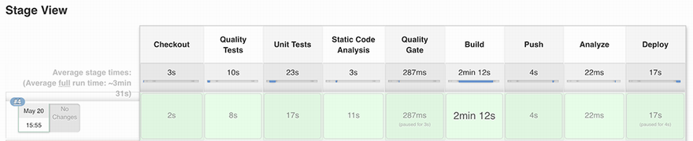

To prepare the environment, ensure that these sets of pre-requisites are followed:
 1. Install ansible version up to 2.0 [a link](https://docs.ansible.com/ansible/latest/installation_guide/intro_installation.html)
 2. Install vagrant tool [a link](https://www.vagrantup.com/docs/installation)
 3. vagrant up 

 The environment will be installing a kubernetes master with 2 nodes and jenkins master with jenkins slave.
As a prerequisistes, nesure that you are adding a jenkins slave by folloiwng the steps from this guide [a link](https://devopscube.com/setup-slaves-on-jenkins-2/)

# movie-recommender will be hosted in the jenkins slave
Here is the source code for the movie recommender tutorial.
# Run
To run the movie recommender, one must have Docker and Docker compose installed.
Then at a terminal inside the repo, one can run the docker compose with the following command:
Jenkinsfile will be installing the movie-recommnder application by using `docker-compose up`

# Build the pipeline

At the Deploy stage, the kubectl apply command will be executed to deploy the application deployment resources. On your local machine, run this command to list deployments running in the sandbox K8s cluster:

kubectl get deployments --namespace=watchlist
The four components (loader, parser, store, and marketplace) of our application will be deployed alongside a MongoDB server:

These deployment resources are referencing Docker images stored in Amazon ECR. 
At the time of deploying the EKS cluster, we have granted permissions to the K8s cluster to interact with ECR. However, if your Docker images are hosted on a remote repository that requires username/password authentication, you need to create a Docker Registry secret with the following command:

kubectl create secret docker-registry registry 
--docker-username=USERNAME
--docker-password=PASSWOR.
--namespace watchlist
Then, you need to reference this secret in your deployment file under the spec section as follows:

spec:
  containers:
  - name: movies-loader
    image: REGISTRY_URL/USER/movies-loader:develop
  imagePullSecrets:
  - name: registry
Our application is deployed. To access it, we need to create a K8s service for both the marketplace and store, as shown in the following listing. Create a services directory in the root repository, and then create a service for movies-store called movies-store.svc.yaml. The service creates a cloud network load balancer (for instance, AWS Elastic Load Balancer). This provides an externally accessible IP address for accessing the Movies Store API.

Movie store service resource can be created by using the following template

apiVersion: v1
kind: Service
metadata:
  name: movies-store
  namespace: watchlist
spec:
  ports:
  - port: 80
    targetPort: 3000
  selector:
    app: movies-store
  type: LoadBalancer
Additionally, we create another service to expose the Movies Marketplace (UI). Add the content in the following listing to movies-marketplace.svc.yaml.

Listing 11.8 Movies Marketplace service resource

apiVersion: v1
kind: Service
metadata:
  name: movies-marketplace
  namespace: watchlist
spec:
  ports:
  - port: 80
    targetPort: 80
  selector:
    app: movies-marketplace
  type: LoadBalancer
The movies-store and movies-parser services store the movie metadata in a MongoDB service. Therefore, we need to expose the MongoDB deployment through a Kubernetes service to allow MongoDB to receive incoming operations. The service is exposed to an internal IP in the cluster. The ClusterIP keyword makes the service reachable from only within the cluster. The MongoDB pod targeted by the service is determined by LabelSelector. Add the following YAML block to mongodb-svc.yaml.

apiVersion: v1
kind: Service
metadata:
  name: mongodb
  namespace: watchlist
spec:
  ports:
    - port: 27017
  selector:
    app: mongodb
    tier: mongodb
  clusterIP: None
Finally, we update the Jenkinsfile in listing 11.6 to deploy the Kubernetes services by providing the services folder as a parameter to the kubectl apply command:

stage('Deploy'){
        sh 'kubectl apply -f deployments/'
        sh 'kubectl apply -f services/'
}

Type the following command on your local machine:

kubectl get svc -n watchlist
It should show the load balancers for the three K8s services:

NOTE Make sure to set the load balancer FQDN in the environment.sandbox.tf file of the movies-marketplace project. The API URL will be injected while building the marketplace Docker image. Refer to section 9.1.2 for more details.

To secure access to the Store API, we can enable an HTTPS listener on the public load balancer by updating the movies-store service with the changes detailed in the following listing.

apiVersion: v1
kind: Service
metadata:
  name: movies-store
  namespace: watchlist
  annotations:
    service.beta.kubernetes.io/aws-load-balancer-backend-protocol: http   
    service.beta.kubernetes.io/aws-load-balancer-ssl-cert:                
     arn:aws:acm:{region}:{user id}:certificate/{id}                      
    service.beta.kubernetes.io/aws-load-balancer-ssl-ports: "https"       
spec:
  ports:
  - name: http
    port: 80
    targetPort: 3000
  - name: https                                                           
    port: 443                                                             
    targetPort: 3000                                                      
  selector:
    app: movies-store
  type: LoadBalancer
 Used on the service to specify the protocol spoken by the backend (pod) behind a listener

 Exposes port 443 (HTTPS) and forwards requests internally to port 3000 of the movies-store pod

Push the changes to the remote repository. Jenkins will deploy the changes and update the load balancer listener configuration to accept incoming traffic on port 443 (HTTPS), as shown in figure 11.8.

It’s optional, but you can create an A record in Amazon Route 53 pointing to the load balancer FQDN and update environment.sandbox.ts to use the friendly domain name instead of the load balancer FQDN; see the following listing.

export const environment = {
  production: false,
  apiURL: 'https://api.sandbox.domain.com',
};
If you point your browser to the marketplace URL, it should call the Movies Store API and list the movies crawled from IMDb pages, as shown in figure 11.9. It might take several minutes for DNS to propagate and for the marketplace to show up.

Figure 11.9 Watchlist Marketplace application

Now, every time you change the source code of any of the four microservices, the pipeline will be triggered, and the changes will be deployed to the sandbox Kubernetes cluster, as shown in figure 11.10.

Finally, to visualize our application, we can deploy the Kubernetes dashboard by issuing the following commands in a terminal session:

kubectl apply -f https://github.com/kubernetes-sigs/
metrics-server/releases/latest/download/components.yaml
kubectl apply -f https://raw.githubusercontent.com/kubernetes/
dashboard/v2.0.5/aio/deploy/recommended.yaml
These commands will deploy the metrics-server and K8s dashboard v2.0.5 under the kube-system namespace. The metrics-server, which collects resource metrics from Kubelet, has to be running in the cluster for the metrics and graphs to be available in the Kubernetes dashboard.

To grant access to cluster resources from the K8s dashboard, we need to create an eks-admin service account and cluster role binding to securely connect to the dashboard with admin-level permissions. Create an eks-admin.yaml file with the content in the following listing (apiVersion of the ClusterRoleBinding resource may differ between Kubernetes versions).

This template shows Kubernetes dashboard service account

apiVersion: v1
kind: ServiceAccount
metadata:
  name: eks-admin
  namespace: kube-system
---
apiVersion: rbac.authorization.k8s.io/v1beta1
kind: ClusterRoleBinding
metadata:
  name: eks-admin
roleRef:
  apiGroup: rbac.authorization.k8s.io
  kind: ClusterRole
  name: cluster-admin
subjects:
- kind: ServiceAccount
  name: eks-admin
  namespace: kube-system
Then, create a service account with the following command:

kubectl apply -f eks-admin.yaml

Now, create a proxy server that will allow you to navigate to the dashboard from the browser on your local machine. This will continue running until you stop the process by pressing Ctrl-C. 
Issue the kubectl proxy command, and the dashboard should be accessible from http://localhost:8001/api/v1/namespaces/kubernetes-dashboard/services/https:kubernetes-dashboard:/proxy/#/login.

Opening this URL will take us to the account authentication page for the Kubernetes dashboard. To get access to the dashboard, we need to authenticate our account. Retrieve an authentication token for the eks-admin service account with the following command:

kubectl -n kube-system describe secret 
$(kubectl -n kube-system get secre.
| grep eks-admi.
| awk '{print $1}')
Now copy the token and paste it into the Enter Token field on the login screen. Click the Sign In button, and that’s it. You are now logged in as an admin.

The Kubernetes dashboard, shown in figure 11.11, provides user-friendly features to manage and troubleshoot the deployed application. Awesome! You have successfully built a CI/CD pipeline for a cloud-native application in K8s.

# Migrating Docker Compose to K8s manifests with Kompose
Another way of creating deployment files is by converting the docker-compose.yml file defined in chapter 10’s listing 10.12 with an open source tool called Kompose. Refer to the project’s official GitHub repository (https://github.com/kubernetes/kompose) for an installation guide.

Once Kompose is installed, run the following command against the docker-compose.yml file provided in chapter 10 (chapter10/deployment/sandbox/docker-compose.yml):

kompose convert -f docker-compose.yml
This should create the Kubernetes deployments and services based on the settings and network topology specified in docker-compose.yml:

You can push those files to the remote Git repository, and Jenkins will issue the kubectl apply -f command to deploy the services and deployments.

However, writing and maintaining Kubernetes YAML manifests for all the required Kubernetes objects can be a time-consuming and tedious task. For the simplest of deployments, you would need at least three YAML manifests with duplicated and hardcoded values. That’s where a tool like Helm (https://helm.sh/) comes into play to simplify this process and create a single package that can be advertised to your cluster.

# Walking through continuous delivery steps
Helm is a useful package manager for Kubernetes. It has two parts: the client (CLI) and the server (which is called Tiller and was removed in Helm 3). The client lives on your local machine, and the server lives on the Kubernetes cluster to execute what is needed.

To fully grasp Helm, you need to become familiar with these three concepts.

Chart—A package of preconfigured Kubernetes resources

Release—A specific instance of a chart that has been deployed to the cluster by using Helm

Repository—A group of published charts that can be made available to others through a remote registry

Check out the getting started page for instructions on downloading and installing Helm: https://helm.sh/docs/intro/install/.

NOTE Helm is assumed to be compatible with n-3 versions of Kubernetes. Refer to the Helm Version Support Policy documentation to determine which version of Helm is compatible with your K8s cluster.

At the time of writing this book, Helm v3.6.1 is being used. After installing Helm, create a new chart for the application called watchlist in the top-level directory of the watchlist-deployment project:

helm create watchlist
This should create a directory called watchlist with the following files and folders:

Values.yaml—Defines all values we want to inject into Kubernetes templates

Chart.yaml—Can be used to describe the version of the chart we’re packaging

.helmignore—Similar to .gitignore and .dockerignore, contains a list of files and folders to exclude while packaging the Helm chart

templates/—Contains the actual manifest such as Deployments, Services, ConfigMaps, and Secrets

Next, define template files inside the templates folder for each microservice. The template file describes how to deploy each service on Kubernetes:

For instance, the movies-loader template folder uses the same deployment files we defined in listing 11.4, except it references variables defined in values.yaml.

The deployment.yaml file is responsible for deploying a deployment object based on the movies-loader Docker image. This definition pulls the built Docker image from the Docker Registry and creates a new deployment with it in Kubernetes; see the following listing.

Movie loader deployment

apiVersion: apps/v.
kind: Deploymen.
metadata.
  name: movies-loader
  namespace: {{ .Values.namespace }}
  labels.
    app: movies-loader
    tier: backen.
spec:
  selector.
    matchLabels.
      app: movies-loader
  template.
    metadata.
      name: movies-loader
      labels.
        app: movies-loader
        tier: backen.
      annotations:
        jenkins/build: {{ .Values.metadata.jenkins.buildTag | quote }}
        git/commitId: {{ .Values.metadata.git.commitId | quote }}
    spec:
      containers.
        - name: movies-loader
          image: "{{ .Values.services.registry.uri }}/
mlabouardy/movies-loader:{{ .Values.deployment.tag }}&quot.
          imagePullPolicy: Always
          envFrom:
            - configMapRef:
                name: {{ .Values.namespace }}-movies-loader
            - secretRef:
                name: {{ .Values.namespace }}-secrets
          {{- if .Values.services.registry.secret }}
          imagePullSecrets:
          - name: {{ .Values.services.registry.secret }}
          {{- end }}
Helm charts use {{}} for templating, which means that whatever is inside will be interpreted to provide an output value. We can also use a piping mechanism to combine two or more commands for scripting and filtering.

The movies-loader container reference environment variables like AWS_REGION and SQS_URL are defined in configmap.yaml, as shown in the following listing.

Listing 11.14 Movie loader ConfigMap

apiVersion: v1
kind: ConfigMap
metadata:
  name: {{ .Values.namespace }}-movies-loader
  namespace: {{ .Values.namespace }}
  labels.
    app: {{ .Values.namespace }}-movies-loader
data:
  AWS_REGION: {{ .Values.services.aws.region }}
  SQS_URL: https://sqs.{{ .Values.services.aws.region }}
.amazonaws.com/{{ .Values.services.aws.account }}/
movies_to_parse_{{ .Values.environment }}
The deployment file also references sensitive information such as MongoDB credentials. These credentials are stored securely in Kubernetes secrets, which are provided in the following listing.

Application secrets

apiVersion: v1
kind: Secret
metadata:
  name: {{ .Values.namespace }}-secrets
  namespace: {{ .Values.namespace }}
data:
  MONGO_URI: {{ .Values.services.mongodb.uri | b64enc }}
  MONGO_DATABASE : {{ .Values.mongodb.mongodbDatabase | b64enc }}
  MONGODB_USERNAME : {{ .Values.mongodb.mongodbUsername | b64enc }.
  MONGODB_PASSWORD : {{ .Values.mongodb.mongodbPassword | b64enc }}
Helm charts make it easy to set overridable defaults in the values.yaml file, allowing us to define a base setting. We can move as many variables as we want out of the template and into the values.yaml file. This way, we can easily update and inject new values at installation time:

namespace: 'watchlist'
services:
  registry:
    uri: ''
    secret: ''
deployment:
  tag: ''
  workers:
    replicas: 2
This allows us to create a portable package that can be customized during runtime by overriding the values.

Also, note the use of custom annotations or metadata in the deployment file. We will inject the Jenkins build ID and Git commit ID during the build of the Helm chart. This can be useful for debugging and troubleshooting running Kubernetes deployments:

annotations:
        jenkins/build: {{ .Values.metadata.jenkins.buildTag | quote }}
        git/commitId: {{ .Values.metadata.git.commitId | quote }}
MongoDB offers a stable and official Helm chart that can be used for straightforward installation and configuration on Kubernetes. We define the MongoDB chart as a dependency in Chart.yaml under the dependencies section:

dependencies:
  - name: mongodb
    version: 7.8.10
    repository: https://charts.bitnami.com/bitnami
    alias: mongodb
Now that our chart is defined, on your terminal session, issue the following command to install the watchlist application via the Helm chart we just created:

helm install watchlist ./watchlist -f values.override.yaml
The command takes the values.override.yaml file, which contains the values to override at runtime, such as the environment name and MongoDB username and password:

environment: 'sandbox'
mongodb:
  mongodbUsername: 'watchlist'
  mongodbPassword: 'watchlist'
deployment:
  tag: 'develop'
  workers:
    replicas: 2
Check installation progress by checking the status of deployments and pods. Type kubectl get pods -n watchlist to show the running pods:

NOTE To check the generated manifests of a release without installing the chart, use the --dry-run flag to return rendered templates.

We can now update the Jenkinsfile (chapter11/Jenkinsfile.eks) to use the Helm command line instead of kubectl. Since our application chart is already installed, we will use the helm upgrade command to upgrade the chart. This command takes as a parameter values to override, and sets the annotation values from the Jenkins environment variable BUILD_TAG and the commitID() method, as shown next.

Helm upgrade within the Jenkins pipeline

stage('Deploy'){
        sh """
            helm upgrade --install watchlis.
./watchlist -f values.override.yaml \
                --set metadata.jenkins.buildTag=${env.BUILD_TAG} \
                --set metadata.git.commitId=${commitID()}
        """
}
Helm tries to perform the least invasive upgrade. It will update only things that have changed since the last release.

Push the changes to the develop branch. The GitHub repository should look similar to figure 11.12.

Watchlist Helm chart

On Jenkins, a new build will be triggered. At the end of the Deploy stage, the helm upgrade command will be executed; the output is shown in figure 11.13.

Helm upgrade output

Now every change on the develop branch will build a new Helm chart and create a new release on the sandbox cluster. If the Docker image has been changed, Kubernetes rolling updates provide the functionality to deploy changes with 0% downtime.

NOTE If something does not go as planned during a release, rolling back to a previous release is easy by using the helm rollback command.

For code promotion to the staging environment, we just need to update the values .override.yaml file to set the environment value to staging and use the preprod image tag, as shown in the following listing.

Staging variable.

environment: 'staging'
mongodb:
  mongodbUsername: 'watchlist'
  mongodbPassword: 'watchlist'
deployment:
  tag: 'preprod'
  workers:
    replicas: 2
If you push the changes to the preprod branch, the application will be deployed to the Kubernetes staging cluster, as shown in figure 11.14.

# CI/CD workflow on preprod branch

We can verify that the preprod version has been deployed by typing the following command:

kubectl describe deployment movies-marketplace -n watchlist
The movies-marketplace deployment has annotations with git/commitId equal to the GitHub commit ID responsible for triggering the Jenkins job, and the jenkins/build annotation’s value is the name of the Jenkins job that triggered the deployment (figure 11.15).

Movies Marketplace deployment description

For production deployment, update values.override.yaml with proper values, as shown in the following listing. In this example, we set the image tag to latest, the environment to production, and we configure five replicas of the movies-parser service.

Production variables

environment: production
mongodb:
  mongodbUsername: 'watchlist'
  mongodbPassword: 'watchlist'
deployment:
  tag: 'latest'
  workers:
    replicas: 5
Push the new files to the master branch. At the end of the pipeline, the stack will be deployed to the K8s production cluster.

Now if a push event occurs on the master branch on any of the four microservices, the CI/CD pipeline will be triggered, and user approval will be requested, as shown in figure 11.16.

# User approval for production deployment

If the deployment is approved, the watchlist-deployment job will be triggered, and the master nested job will be executed. As a result, a new Helm release of the watchlist application will be created in production, as shown in figure 11.17.

# Application deployment in production

Upon the completion of the deployment process, a Slack notification will be sent to a preconfigured Slack channel, as shown in figure 11.18.

# Production deployment Slack notification

Run the kubectl get pods command. This should display five pods based on the movies-parser Docker image:

To view the marketplace dashboard, locate the external IP of the load balancer in the EXTERNAL-IP column of the kubectl get services -n watchlist output:

Navigate to that address in your browser, and the Movies Marketplace UI should be displayed, as you can see in figure 11.19.

# Marketplace production environment

Under a production environment, you would replace the load balancer FQDN with an alias in Route 53. Refer to the official AWS documentation for instructions: http://mng.bz/Rq8P.

# Packaging Kubernetes applications with Helm
So far, you have seen how to create one single chart for the microservices-based application and how to create a new release with Jenkins upon new Git commits. Another way of packaging the application is to create separate charts for each microservice, and then reference those charts as dependencies in the main chart (similar to a MongoDB chart). Figure 11.20 illustrates how Helm charts are packaged within a CI/CD pipeline.

# CI/CD of containerized application with Helm

On a push event, a Jenkins build will be triggered to build the Docker image and package the new release in a Helm chart. From there, the new chart is deployed to the corresponding Kubernetes environment. Along the way, a Slack notification is sent to notify the developers about the pipeline status.

On the movies-marketplace project, create a new Helm chart in the top-level directory by typing the following command:

helm create chart
It should create a new folder called chart with the following structure:

As mentioned earlier, a Helm chart consists of metadata used to help describe the application, define constraints on the minimum required Kubernetes and/or Helm version, and manage the version of the chart. All of this metadata lives in the Chart.yaml file (chapter11/microservices/movies-marketplace), shown in the following listing.

## Movie loader chart

apiVersion: v2
name: movies-marketplace
description: UI to browse top 100 IMDb movies
type: application
version: 1.0.0
appVersion: 1.0.0
To be able to reference this chart from the main watchlist chart, we need to store it somewhere. Many open source solutions are available for storing Helm charts. GitHub can be used as a remote registry for Helm charts. Create a new GitHub repository called watchlist-charts and create an empty index.yaml file. This file will contain the metadata about available charts in the repository.

NOTE Nexus Repository OSS supports Helm charts as well. You can publish charts to a Helm-hosted repository on Nexus.

Then, push this file to the master branch by issuing these commands.

git clone https://github.com/mlabouardy/watchlist-charts.git
cd watchlist-charts
touch index.yaml
git add index.yaml
git commit -m "add index.yaml"
git push origin master

With the private Helm repository ready to be used, let’s package and publish our first Helm chart. 
The Build stage should look like the following listing. (The complete Jenkinsfile is available at chapter11/pipeline/movies-marketplace/Jenkinsfile.)

stage('Build') {
 parallel(
  'Docker Image': {
   switch (env.BRANCH_NAME) {
    case 'develop':
       docker.build(imageName, '--build-arg ENVIRONMENT=sandbox .')     
     break
    case 'preprod':
       docker.build(imageName, '--build-arg ENVIRONMENT=staging .')     
     break
    ...
   }
  },
  'Helm Chart': {
     sh 'helm package chart'                                            
  }
 )
}
❶ Builds the appropriate Docker image by injecting the target environment settings

❷ Packages the application in a Helm chart

The helm package command, as its name indicates, packages the chart directory into a chart archive (movies-marketplace-1.0.0.tgz). Finally, update the Push stage to use a parallel step as well, as shown in the following listing.

Listing 11.21 Storing the Docker image in a private registry

stage('Push') {
 parallel(
  'Docker Image': {
    sh "\$(aws ecr get-login --no-include-email --region ${region}) || true" 
    docker.withRegistry("https://${registry}") {                             
        docker.image(imageName).push(commitID())                             
        if (env.BRANCH_NAME == 'develop') {                                  
            docker.image(imageName).push('develop')                          
        }                                                                    
        ...                                                                  
    }                                                                        
  },
  'Helm Chart': {                                                            
    ...
  }
 )
}
❶ Authenticates with ECR in order to push the Docker images afterward

❷ Tags and stores the image in ECR

❸ Publishes the Helm chart to GitHub—see listing 11.22 for complete instructions.

The Helm Chart stage will clone the watchlist-charts GitHub repository with the git clone command, and add the metadata of the new packaged Helm chart to index.yaml with the helm repo index command. Then it pushes index.yaml and the archive chart to the Git repository; see the following listing.

Listing 11.22 Publishing the Helm chart to GitHub

'Helm Chart': {
    sh 'helm repo index --url https://mlabouardy.github.io/watchlist-charts/ .' ❶
    sshagent(['github-ssh']) {                                                  ❷
      sh 'git clone git@github.com:mlabouardy/watchlist-charts.git.
      sh 'mv movies-marketplace-1.0.0.tgz watchlist-charts/'
      dir('watchlist-charts'){                                                  ❸
          sh 'git add index.yaml movies-marketplace-1.0.0.tg.
&& git commit -m "movies-marketplace&quot.
&& git push origin master'                                                      ❹
      }
     }
  }
❶ Generates an index file, given a directory containing packaged charts

❷ Provides SSH credentials to builds via an ssh-agent

❸ Changes current directory to watchlist-charts folder

❹ Commits and pushes the archive and index file to GitHub

If you push the new Jenkinsfile to the Git remote repository, a new pipeline will be triggered, as shown in figure 11.23. At the Build stage, the movies-marketplace Docker image and Helm chart will be packaged. Next, the Push stage will be executed to push the Docker image to the Docker private registry and the Helm chart to the GitHub repository.

# CI/CD workflow with Helm and Docker

Upon the completion of the CI/CD pipeline, a new archived chart will be available in the GitHub repository, as shown in figure 11.24.

# Packaging the Movies Marketplace chart

The index.yaml file will reference the newly built Helm chart under the entries section, as you can see in figure 11.25.

# Helm repository metadata

You can override the chart version set in Chart.yaml by providing the new version with the --version flag at the time of packaging a Helm chart:

sh 'helm package chart --app-version ${appVersion} --version ${chartVersion}'
Repeat the same steps for other repositories to create a Helm chart per service. Once done, the Helm charts repository should contain four archived files (figure 11.26).

# Application charts stored in the GitHub repository

Next, we configure the GitHub repository as a Helm repository:

helm repo add watchlist https://mlabouardy.github.io/watchlist-charts
Finally, we can reference these charts in the watchlist Chart.yaml file under the dependencies section, as shown in the following listing.

Watchlist application charts

apiVersion: v2
name: watchlist
description: Top 100 iMDB best movies in history
type: application
version: 1.0.0
appVersion: 1.0.0
maintainers:
    - name: Mohamed Labouardy
      email: mohamed@labouardy.com
dependencies:
  - name: mongodb
    version: 7.8.10
    repository: https://charts.bitnami.com/bitnami
    alias: mongodb
  - name: movies-loader
    version: 1.0.0
    repository: https://mlabouardy.github.io/watchlist-charts
  - name: movies-parser
    version: 1.0.0
    repository: https://mlabouardy.github.io/watchlist-charts
  - name: movies-store
    version: 1.0.0
    repository: https://mlabouardy.github.io/watchlist-charts
  - name: movies-marketplace
    version: 1.0.0
    repository: https://mlabouardy.github.io/watchlist-charts
Now that all pieces are running together and we checked the core functionality, let’s validate that the solution is up for a typical GitFlow development process.

11.5 Running post-deployment smoke tests
The microservices are deployed. However, that doesn’t mean these services are properly configured and correctly performing all the jobs that they’re supposed to be doing.

You want to have a health check that indicates the current health operation of your services. You can set up a simple one by implementing an HTTP request to a service URL and check whether the response code is 200.

For instance, let’s implement a health check for the movies-store service. Update the Jenkinsfile of the movies-store project (chapter11/pipeline/movies-store/Jenkinsfile) to add the function shown in the following listing.

Groovy function to return API URL

def getUrl(){
    switch(env.BRANCH_NAME){
        case 'preprod':
            return 'https://api.staging.domain.com'
        case 'master':
            return 'https://api.production.domain.com'
        default:
            return 'https://api.sandbox.domain.com'
    }
}
The function returns the service URL based on the current Git branch name. Finally, we add a Healthcheck stage at the end of the pipeline to issue a cURL command on the service URL:

stage('Healthcheck'){
    sh "curl -m 10 ${getUrl()}"
}
The -m flag is used to set a time-out of 10 seconds, to give Kubernetes enough time to pull the latest built image and deploy the changes into the cluster before checking the service health status.

Once you push the changes to the Git remote repository, a new build will be triggered. Upon the completion of the CI/CD pipeline, a cURL command will be executed with a GET request on the service URL, as shown in figure 11.27.

If the service responds before the expiration time-out, the cURL command will return a successful exit code. Otherwise, an error will be thrown to make the pipeline fail.

However, if the service is responding, that doesn’t mean it’s working correctly or a new version of the service has been successfully deployed.

To be able to issue advanced HTTP requests against the service URL, we will install the Jenkins HTTP Request plugin (www.jenkins.io/doc/pipeline/steps/http_request/) from the Jenkins Plugins page.

We can now update the movies-store’s Jenkinsfile. The plugin offers an httpRequest DSL object that can be used to call a remote URL. In the following listing, httpRequest returns a response object that exposes the response body through a content attribute. Then, we use the JsonSlurper class to parse the response to a JSON object. The updated Healthcheck stage is shown in the following listing.

Movie store Healthcheck stage

stage('Healthcheck'){
     def response = httpRequest getUrl()
     def json = new JsonSlurper().parseText(response.content)
     def version = json.get('version')
 
     if version != '1.0.0' {
        error "Expected API version 1.0.0 but got ${version}"
     }
}
The service returns the version number deployed in Kubernetes. This value is fixed in the service source code, but you can inject the Jenkins build ID as a version number while building the Docker image of the service and check whether the returned version is equal to the Jenkins build ID at the Healthcheck stage.

Figure 11.29 shows the end result of the CI/CD pipeline of each microservice running in Kubernetes.

Figure 11.29 Complete CI/CD workflow for containerized microservices

When you opt for Jenkins to build cloud-native applications running in Kubernetes, you’re required to create extensive configurations, as well as spending considerable time learning and using all of the necessary plugins to make it happen. Fortunately, Jenkins X comes into play to offer simplicity and ready-to-go templates.

# Discovering Jenkins X
Jenkins X (https://jenkins-x.io/) is a CI/CD solution for modern cloud applications on Kubernetes. It’s used to simplify the configurations and lets you harness the power of Jenkins 2.0. It also lets you use open source tools like Helm, Artifact Hub, ChartMuseum, Nexus, and Docker Registry to easily build cloud-native applications.

Jenkins X runs on a Kubernetes cluster. If you’re running on one of the major cloud providers (Amazon EKS, GKE, or AKS), Jenkins X provides multiple approaches for creating this cluster:

jx create cluster eks --cluster-name=watchlist
Jx create cluster aks --cluster-name=watchlist
Jx create cluster gke --cluster-name=watchlist
Jx create cluster iks --cluster-name=watchlist
NOTE You can run Jenkins X on the existing EKS cluster by referring to the official guide at https://jenkins-x.io/v3/admin/setup/operator/.

Install Jenkins X on a K8s cluster by issuing the following command from your terminal session:

jx boot
You will be asked a series of questions that will configure the installation, as shown in figure 11.30.

When the installation is done, you will be presented with useful links and the password for your Jenkins X–related services. Don’t forget to save it somewhere for future use.

Jenkins X also deploys a set of supporting services, including the Jenkins dashboard, Docker Registry, ChartMuseum, and Artifact Hub to manage Helm charts, and Nexus, which serves as a Maven and npm repository.

The following is the output of the kubectl get svc command:

Point your browser to the Jenkins URL printed during the installation process and sign in with the admin username and password displayed previously in figure 11.30. The dashboard in figure 11.31 should be served.

It is possible to run Jenkins in serverless mode while installing Jenkins X. Then, instead of running the Jenkins web dashboard, which continuously consumes CPU and memory resources, you can run Jenkins only when you need it.

The Jenkins X installation also creates two Git repositories by default: one for your staging environment and one for production, as shown in figure 11.32:

Staging—Any merge performed on the project master branch will automatically be deployed as a new version to staging (auto promote).

Production—You will have to manually promote your staging application version into production by using a jx promote command.

Jenkins X uses these repositories to manage deployments to each environment, and promotions are done via Git pull requests. Each repository contains a Helm chart that specifies the applications to be deployed to the corresponding environment. Each repository also has a Jenkinsfile to handle promotions.

Now that you have a working cluster with Jenkins X installed, we are going to create an application that can be built and deployed with Jenkins X. For clarity, I have created a RESTful API in Go that serves an HTTP endpoint with a list of the top 100 IMDb movies. We will import this project inside Jenkins with this command:

jx import
If you wish to import a project that is already in a remote Git repository, you can use the --url argument:

jx import --url https://github.com/mlabouardy/jx-movies-store
The following is the output of the import command:

Jenkins X will go over the code and choose the right default build pack for the project based on the programming language. Our project was developed in Go, so it will be a Go build pack. Jenkins X will generate a Jenkinsfile, Dockerfile, and Helm chart based on the project runtime environment. The import command will create a remote repository on GitHub, register a webhook, and push the code to the remote repository, shown in figure 11.33.

Figure 11.33 Application GitHub repository

Jenkins X will also automatically create a Jenkins multibranch pipeline job for the project, and the pipeline will be triggered. You can check the progress of the pipeline with this command:

jx get activity -f jx-movies-store -w

You can also track the progress of the pipeline from the Jenkins dashboard by clicking the project job; figure 11.34 shows the result.

The pipeline stages are executed on a Kubernetes pod running in the Kubernetes cluster we provisioned earlier, as you can see in figure 11.35.

The executed pipeline will clone the repository, build the Docker image, and push it to a Docker registry, as shown in the following listing.

Listing 11.26 Build stage when an event occurs on master branch

stage('Build Release') {
      when {
        branch 'master'
      }
      steps {
        container('go') {
          dir('/home/jenkins/agent/go/src/
github.com/mlabouardy/jx-movies-store') {
            checkout scm
            sh "git checkout master"
            sh "git config --global credential.helper store"
            sh "jx step git credentials"
            sh "echo \$(jx-release-version) > VERSION"
            sh "jx step tag --version \$(cat VERSION)"
            sh "make build"
            sh "export VERSION=`cat VERSION.
&& skaffold build -f skaffold.yaml"
            sh "jx step post build --image $DOCKER_REGISTRY/$ORG/$APP_NAME:\$(cat VERSION)"
          }
        }
      }
}
A Helm chart will be packaged and pushed to the ChartMuseum repository, and a new release will be published on the project GitHub repository, as shown in figure 11.36. Jenkins X uses semantic versioning for tagging.

Figure 11.36 Publishing the application release

The release will be promoted automatically to the staging environment, as shown in figure 11.37.

During the promotion stage, a new PR will be created by Jenkins X to deploy the new release to staging. This PR will add our application and its version in the env/requirements.yaml file inside the Git repository, as shown in figure 11.38.

When you’re satisfied with your application, you can use the jx CLI to promote the application to a different environment using a GitOps approach. For example, we can promote our application to production with the following command:

jx promote --app jx-movies-store --version 0.0.3 --env production
A new PR will be created, but this time on our production repository, and the environment-watchlist-production job is triggered, as shown in figure 11.46.

Once the pull request is validated, the production pipeline runs Helm, which deploys the environment, pulling Helm charts from ChartMuseum, and Docker images from the Docker Registry. Kubernetes creates the project’s resources, typically a pod, service, and ingress.

Jenkins X uses Git branch patterns to determine which branch names are automatically set up for CI/CD. By default, the master branch, and any branch starting with PR- or feature will be scanned. You can set up your own branch discovery mechanism with the following command:

jx import --branches "develop|preprod|master|PR-.*"